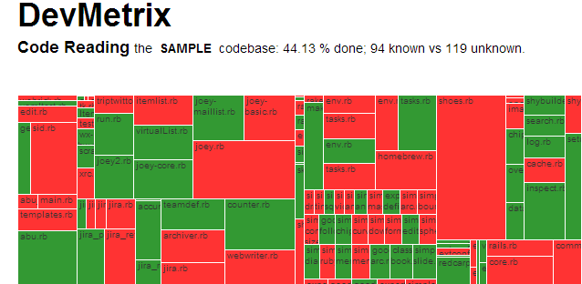

DevMetrix
=========

DevMetrix is a visualization tool for codebases. It currently has one visualization: Code Reading Status.

Visualization: Code Reading
---------------------------
The Code Reading visualization shows the current status of a Code Reading activity by a Dev team. Given a codebase - as represented by its list of files - and a status for each such file - known/unknown, this visualization will show a treemap of those files with the size of the file as its physical dimensions and a red/green color representing the status.

Here's a sample:

Using DevMetrix
---------------

1. Clone this repo. Its dependent `d3.js` is already in `lib`.
2. Create your data file. This is mostly "borrowed" from [CodeFlower's dataConverter.js](https://github.com/fzaninotto/CodeFlower/blob/master/javascripts/dataConverter.js) and has these general steps:
	1. Do a `find <dir> <opts> | xargs wc -l > data/output.txt` to get the basic data.
	2. Switch the columns around so that it looks like `data/data.csv.sample`. The additional column `known` has to be currently hand filled with a 0 or a 1 (for unknown vs known).
	3. Add a reference to this file in `sources.csv`. A sample is in `sources.csv.sample`.
3. Load up `index.html` via a web server.

Status
------
Basic working version 1.0 available.

Todos
-----

- [X] Fix such that all files in sources.csv can be loaded
- [ ] Create tools to manipulate data instead of current manual steps.

Credits
-------
- `d3.js` for the awesome viz library.
- CodeFlower for the inspiration on how to deal with the source.
