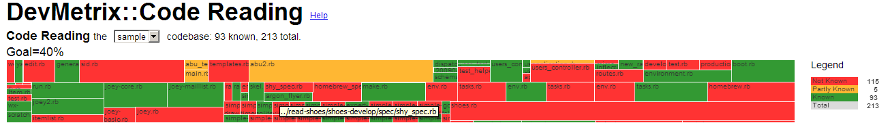

DevMetrix
=========

DevMetrix is a visualization tool for codebases. It currently has one visualization: Code Reading Status.

Visualization: Code Reading
---------------------------
The Code Reading visualization shows the current status of a Code Reading activity by a Dev team. Given a codebase - as represented by its list of files - and a status for each such file ranging from unknown to known, this visualization will show a treemap of those files with the size of the file as its area and an appropriate color representing the status.

Here's a sample:

Using DevMetrix
---------------

1. Clone this repo. Its dependent `d3.js` is already in `lib`.
2. Create your data files. Two files are required in the `data` directory:
	- data.csv: Used to create the treemap. It has 3 columns: filePath,size,known. The easiest way to generate this file is:
		1.	Do a `find <dir> –name *.<ext> | xargs wc –l > data/output.txt`. This will produce a file with 2 cols: size and filepath. (On Windows, the easiest way is to use Portable Git or Cygwin to get a unix env – the dir command is not good enough).
		2. Open this file up in Excel or OO and switch the columns around so that it looks like `data/data.csv.sample`.
		3. The additional column `known` has to be currently hand filled. The default values expected are 0 or a 1 (for unknown vs known). If you want to display more than 2 states, see instructions below for `colorscale.json`.
		4. File -> Save As CSV.
	- sources.csv: Used to populate the dropdown for multiple files. Has 3 columns: name, filePath and extraInfo. Name is a logical name for the file and can be anything you want. Filepath is the path to the data.csv from above. This has to be manually updated whenever you add a new file. extraInfo can be used to put a custom message below the "Code Reading the <<codebase>>..." line in the display.
		Note: The first row in sources.csv will be loaded up by default. Choose an appropriate data file as large files take a while to load up.
	- colorscale.json: Used to create a custom set of statuses, , values and colors. A sample is included in this repo. When using this, note that:
		- The values in the known column can be any number. The status name, value and color should match up, however.
		- Its recommended to keep the meaning of unknown = red and known = green so its easy to compare 2 displays.
		- If present, the json file applies to all codebases in a directory because the assumption is that one team's status will not differ across codebases.
4. Load up `index.html` **via a web server**. Devmetrix needs a web server because it uses XHR, so local files will not work. However, any webserver will do as it has no server-side logic.

Status
------
Working version 2.0 available.

Todos
-----

- [X] Fix such that all files in sources.csv can be loaded
- [ ] Create tools to manipulate data instead of current manual steps.
- [X] refactor devmetrix.js to make it more understandable - steps made into functions etc.
- [X] Allow more than 2 states to be depicted.

Credits
-------
- `d3.js` for the awesome viz library.
- CodeFlower for the inspiration on how to deal with the source.
